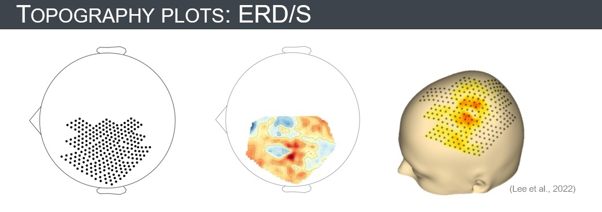

# **Decoding finger movements from uHD-EEG**
The purpose of this project was to replicate the study by [Lee et al. (2022)](https://doi.org/10.3389/fnins.2022.1009878). During the **BCI & Neurotechnology** [spring school](https://www.gtec.at/de/spring-school-2023/) by [g.tec medical engineering GmbH](https://www.gtec.at/) they presented their novel uHD-EEG system named [g.Pangolin](https://www.gtec.at/product/g-pangolin-electrodes/) that can capture up to 1024 channels simultaneously. In the study by Lee et al. (2022), they acquired EEG data from 256 electrodes over the sensorimotor cortex of the contralateral hemisphere to decode individual finger extensions. Since I am interested in diving deeper into machine learning and BCI, I thought I can probably learn a lot by doing my best to replicate their study. This included:

```
│projectdir
│
├── src
│   │
│   ├── nb1_preprocessing.jl       <- Data preprocessing
│   │
│   ├── nb2_featureExtraction.jl   <- Extraction of µ and β band power features
│   │
│   ├── nb3_epoching_erds.jl       <- Epoching (-0.5 to 7 s) and calculating event-related (de)synchronization (ERD/S)
│   │
│   ├── nb4_topographies.jl        <- Creating topography plots
│   │
│   ├── nb5_classification.jl      <- Classification of finger extensions with a linear SVM
│
├── img
│
├── Manifest.toml
│
├── Project.toml
│
├── README.md
```

The **finger extensions** were **classified pairwise** at each timestep during the task period (0 to 5 s) using a **linear SVM**, resulting in 10 two-class classification problems per subject. 158 of the 256 electrodes were contained in the region of interest and were thus used for classification. In the paper, they reported a mean classification accuracy of 64.8%. My results were lower at 58.11%. A reason for this lower accuracy might be that I identified fewer bad channels during the preprocessing, which possibly also explains some observed differences in ERD/S topographies. This discrepancy in the preprocessing needs further investigation. In the 'nb5_classification.jl' I also implemented options to look at different subsets of EEG electrodes, i.e. all 256 electrodes or those corresponding to the (extended) 10-10 system, and to use LDA for classification. Despite some differences in the obtained results, I undoubtedly learned a lot concerning feature extraction, ERD/S calculation, machine learning, etc. during this project. For more details on the EEG system, data acquisition & processing, classification results, etc. have a look at Lee et al. (2022).

## Glance at my results

Implementation and visualization of the &mu; and &beta; band power feature extraction advanced my understanding of the involved signal processing steps significantly:


Comparison of an obtained ERD/S topography plot:



Mean accuracy for pairwise classification with SVM:


## Usage
Navigate in a shell to the current project and start a Julia session:

```console
$ julia --project="."
```

Open the package manager and instantiate the project:

```console
julia> ]
```

```console
(uHD_EEG_decoding) pkg> instantiate
```

## Sources
*Publication*: Lee, H. S., Schreiner, L., Jo, S.-H., Sieghartsleitner, S., Jordan, M., Pretl, H., Guger, C., & Park, H.-S. (2022). Individual finger movement decoding using a novel ultra-high-density electroencephalography-based brain-computer interface system. Frontiers in Neuroscience, 16. https://doi.org/10.3389/fnins.2022.1009878

*Data*: https://osf.io/4dwjt/?view_only=d23acfd50655427fbaae381a17cbfbcc